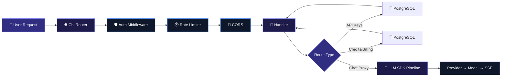

<div align="center">

<!-- ANIMATED HEADER BANNER - Premium Wave Gradient with Glow -->


<br/>

<!-- ANIMATED TYPING TEXT - Multi-line with gradient -->
<a href="https://git.io/typing-svg">
  
</a>

<br/>
<br/>

<!-- PREMIUM BADGES - Tech Stack with hover effects -->
<a href="https://nextjs.org/"></a>
<a href="https://react.dev/"></a>
<a href="https://www.typescriptlang.org/"></a>
<a href="https://go.dev/"></a>
<a href="https://www.postgresql.org/"></a>
<a href="https://www.docker.com/"></a>
<a href="https://turbo.build/"></a>
<a href="https://redis.io/"></a>
<a href="https://stripe.com/"></a>

<br/>
<br/>

<!-- ANIMATED STAT BOXES - Repo Card -->
<picture>
  <source media="(prefers-color-scheme: dark)" srcset="https://github-readme-stats.vercel.app/api/pin/?username=shinmentakezo07&repo=owsiwa&theme=nightowl&hide_border=true&bg_color=0f172a&title_color=818cf8&icon_color=6366f1&text_color=cbd5e1&description_lines_count=2&show_owner=true">
  
</picture>

<br/>

<!-- STATUS BADGES WITH SHIELDS -->
<p>
  
  
  
  
  
  
  
</p>

<br/>

<!-- NAVIGATION KBD BUTTONS WITH GLOW -->
<p align="center">
  <a href="#-features"><kbd> <br/>✨ Features<br/> </kbd></a>&nbsp;
  <a href="#-quick-start"><kbd> <br/>⚡ Quick Start<br/> </kbd></a>&nbsp;
  <a href="#-architecture"><kbd> <br/>🏗️ Architecture<br/> </kbd></a>&nbsp;
  <a href="#-api-reference"><kbd> <br/>📡 API Reference<br/> </kbd></a>&nbsp;
  <a href="#-tech-stack"><kbd> <br/>🛠️ Tech Stack<br/> </kbd></a>&nbsp;
  <a href="#-deployment"><kbd> <br/>🐳 Deploy<br/> </kbd></a>&nbsp;
  <a href="#-roadmap"><kbd> <br/>🗺️ Roadmap<br/> </kbd></a>
</p>

</div>

## 🎯 Why Teams Use Yapapa

<div align="center">

| Problem | Yapapa Fix |
|:--------|:-----------|
| Managing different SDKs for OpenAI, Anthropic, Gemini, Groq, and more | **One unified API** for every provider |
| Vendor lock-in and expensive migration work | **OpenAI-compatible** drop-in layer |
| Poor visibility into token spend and latency | **Built-in analytics, logs, and billing** |
| Hard to compare model quality across providers | **Playground for side-by-side testing** |
| Production auth, quotas, and rate limits take time to build | **Ready-made gateway infrastructure** |

</div>

<br/>

> Yapapa is an **OpenRouter-style universal LLM gateway** built with **Next.js 16 canary + Go 1.25**. It gives you a production-ready control plane for AI traffic: routing, billing, analytics, auth, quotas, webhooks, conversations, prompts, and multi-provider access.

<br/>


<!-- Animated separator -->
<div align="center">
  
</div>

<br/>

<table>
<tr>
<td width="50%" valign="top">

<p align="center">
  
</p>

### 🌐 Unified AI Gateway

**One endpoint for all models.** Switch between GPT-4o, Claude Opus 4, Gemini 2.5, Llama 4, Mistral, Grok, and 100+ others instantly — no code changes, no vendor lock-in.

```typescript
// Just swap the base URL - that's it!
const client = new OpenAI({
  baseURL: "https://yapa.up.railway.app/v1"
});
```

✅ OpenAI-compatible `/v1/chat/completions` proxy  
✅ Automatic failover & load balancing  
✅ Per-model routing & caching  

<br/>

<p align="center">
  
</p>

### 📊 Real-Time Analytics

**Monitor everything in beautiful dashboards.** Track requests, latency, costs, token usage, and model breakdowns with interactive Recharts visualizations.

- 📈 Time-range filtering (7d / 30d / 90d)
- 💰 Cost breakdown by model & provider
- 📊 Exportable CSV/PDF reports
- 🔔 Usage alerts & budget caps

<br/>

<p align="center">
  
</p>

### 🔌 OpenAI-Compatible API

**Drop-in replacement for OpenAI SDKs.** Use any OpenAI client — Python, TypeScript, Go, Rust — against your Yapapa instance. Zero code changes needed.

```bash
# Works with any OpenAI SDK
curl https://yapa.up.railway.app/v1/chat/completions \
  -H "Authorization: Bearer $API_KEY" \
  -d '{"model":"gpt-4o","messages":[...]}'
```

</td>
<td width="50%" valign="top">

<p align="center">
  
</p>

### 🧪 Neural Playground

**Compare models side-by-side in real-time.** Interactive streaming chat with multi-model selection, persistent history, markdown rendering, and code syntax highlighting.

- 🤖 Multi-model simultaneous testing
- 💬 Streaming responses with markdown
- 📝 Persistent conversation history
- 🎨 Code syntax highlighting
- ⚡ Real-time response rendering

<br/>

<p align="center">
  
</p>

### 🔐 Enterprise Security

**JWT + API Key dual authentication.** Built for production with multiple security layers.

- 🔑 NextAuth v5 with GitHub + Google OAuth
- 🛡️ Per-user rate limiting (sliding window + Redis)
- 🌐 CORS protection & request logging
- 👑 Role-based admin controls
- 🔒 bcrypt hashing & input validation

<br/>

<p align="center">
  
</p>

### 💳 Credit-Based Billing

**Pay per token, not per month.** Transparent micro-cent pricing with real-time balance tracking.

- 💰 Stripe integration for payments
- 📊 Real-time balance tracking
- 🎯 Budget caps & spending alerts
- 📜 Transaction history & receipts
- 🚫 No subscriptions, no hidden fees

</td>
</tr>
</table>

<br/>

---

<br/>

<!-- QUICK START SECTION -->
<a id="quick-start"></a>

## 🚀 Quick Start

<div align="center">
  <br/>
  
  <br/><br/>
  
</div>

<br/>

> ⚡ **One command to rule them all**: `bash scripts/dev.sh` installs deps, starts Postgres, pushes schema, seeds the DB, and launches both servers.

<br/>

<table>
<tr>
<td width="33%" align="center">

### **1️⃣** Clone & Install

```bash
git clone https://github.com/shinmentakezo07/owsiwa.git
cd osiwa
npm install
```

📦 Installs all monorepo dependencies

</td>
<td width="33%" align="center">

### **2️⃣** Environment Setup

```bash
cp apps/web/.env.example apps/web/.env.local
cp apps/backend/.env.example apps/backend/.env

# Generate secure secrets:
openssl rand -base64 32  # AUTH_SECRET
openssl rand -base64 32  # NEXTAUTH_SECRET
```

🔐 Don't skip the secrets!

</td>
<td width="33%" align="center">

### **3️⃣** Database & Launch

```bash
docker-compose up -d postgres
cd apps/web && npm run db:setup
npm run dev   # ← from root
```

🚀 Frontend :3000 · Backend :8080

</td>
</tr>
</table>

<br/>

<div align="center">

### 🌐 Services After Launch

| Service | URL | Description |
|:--------|:----|:------------|
| 🌐 **Web App** | [http://localhost:3000](http://localhost:3000) | Next.js 16 frontend with App Router |
| ⚙️ **Backend API** | [http://localhost:8080](http://localhost:8080) | Go 1.25 chi router API server |
| 📚 **API Docs** | [http://localhost:3000/docs](http://localhost:3000/docs) | Interactive OpenAPI documentation |
| 🧪 **Playground** | [http://localhost:3000/playground](http://localhost:3000/playground) | Multi-model AI chat playground |

</div>

<br/>

---

<br/>

<!-- ARCHITECTURE SECTION -->
<a id="architecture"></a>

## 🏗️ Architecture

<div align="center">
  <br/>
  
</div>

<br/>

```math
\large{\text{YAPAPA PLATFORM}}
```

```
┌───────────────────────────────────────────────────────────────────────────────────────────────┐
│                                        🌐 YAPAPA                                              │
│                                                                                               │
│  ┌───────────────────────────────┐          ┌───────────────────────────────────────────────┐ │
│  │       🎨 Next.js 16           │          │            ⚙️ Go 1.25 Backend                   │ │
│  │       (Frontend)              │          │                                                │ │
│  │  ┌───────────────────────┐    │          │  ┌──────────┐  ┌──────────┐  ┌──────────┐    │ │
│  │  │ Landing Page          │    │          │  │   Auth   │  │  Rate    │  │   CORS   │    │ │
│  │  │ AI Playground         │    │          │  │ JWT+Key  │  │  Limit   │  │  + Logs  │    │ │
│  │  │ Dashboard Analytics   │◄───┼──────────┼──┤          │  │(Sliding  │  │          │    │ │
│  │  │ API Key Manager       │    │          │  └────┬─────┘  │  Window) │  └──────────┘    │ │
│  │  │ Billing & Credits     │    │          │       │         └──────────┘                  │ │
│  │  │ Request Logs          │    │          │  ┌────┴──────────────────────────────────┐    │ │
│  │  │ User Settings         │    │          │  │        🌐 Chi Router (v5)             │    │ │
│  │  │ Organizations         │    │          │  └──┬──┬──┬──┬──┬──┬──┬──┬──┬──┬──┬─────┘    │ │
│  │  │ Webhooks              │    │          │     │  │  │  │  │  │  │  │  │  │  │          │ │
│  │  │ Conversations         │    │          │  ┌──┴┐┌┴┐┌┴┐┌┴┐┌┴┐┌┴┐┌┴┐┌┴┐┌┴┐┌┴┐┌┴┐       │ │
│  │  │ Prompts & Files       │    │          │  │A  ││K ││C ││E ││C ││B ││W ││O ││A ││L │  │ │
│  │  └───────────┬───────────┘    │          │  │u  ││e ││h ││m ││o ││a ││e ││r ││d ││o │  │ │
│  │              │               │          │  │t  ││y ││a ││b ││n ││t ││b ││g ││m ││g │  │ │
│  │              ▼               │          │  │h  ││s ││t ││e ││v ││c ││h ││s ││i ││s │  │ │
│  │   ┌────────────────┐        │          │  │   ││  ││  ││d ││  ││h ││o ││  ││n ││  │  │ │
│  │   │ 🐘 PostgreSQL 16 │◄──────┼──────────┼──┤   ││  ││  ││i ││  ││  ││o ││  ││  ││  │  │ │
│  │   │ Drizzle ORM     │        │          │  │   ││  ││  ││n ││  ││  ││k ││  ││  ││  │  │ │
│  │   │ pgx v5 (Pooled) │        │          │  │   ││  ││  ││g ││  ││  ││s ││  ││  ││  │  │ │
│  │   └────────────────┘        │          │  └───┘└──┘└──┘└──┘└──┘└──┘└──┘└──┘└──┘└──┘  │ │
│  │                              │          │                                                │ │
│  │                              │          │  ┌────────────────────────────────────────┐   │ │
│  │                              │          │  │        🤖 LLM SDK Pipeline             │   │ │
│  │                              │          │  │  ┌──────┐ ┌──────┐ ┌──────┐ ┌──────┐  │   │ │
│  │                              │          │  │  │Prov. │ │Trans.│ │Route │ │Cache │  │   │ │
│  │                              │          │  │  └──────┘ └──────┘ └──────┘ └──────┘  │   │ │
│  │                              │          │  │  ┌──────┐ ┌──────┐ ┌──────┐ ┌──────┐  │   │ │
│  │                              │          │  │  │Guard.│ │Moder.│ │Circ. │ │Tele. │  │   │ │
│  │                              │          │  │  └──────┘ └──────┘ └──────┘ └──────┘  │   │ │
│  │                              │          │  │  ┌──────┐ ┌──────┐ ┌──────┐ ┌──────┐  │   │ │
│  │                              │          │  │  │Token │ │Batch │ │Tools │ │Watch │  │   │ │
│  │                              │          │  │  └──────┘ └──────┘ └──────┘ └──────┘  │   │ │
│  │                              │          │  └────────────────────────────────────────┘   │ │
│  │                              │          │                                                │ │
│  │                              │          │  ┌────────────────────────────────────────┐   │ │
│  │                              │          │  │ 📤 Webhooks  📡 SSE     📦 Batch Jobs   │   │ │
│  │                              │          │  │ 📁 File Uploads  📧 Email  📊 Telemetry│   │ │
│  │                              │          │  └────────────────────────────────────────┘   │ │
│  └───────────────────────────────┘          └───────────────────────────────────────────────┘ │
└───────────────────────────────────────────────────────────────────────────────────────────────┘
```

<br/>

### Data Flow



<br/>

---

<br/>

<!-- TECH STACK SECTION -->
<a id="tech-stack"></a>

## 🛠️ Tech Stack

<div align="center">
  <br/>
  
</div>

<br/>

### Frontend

| Technology | Purpose | Version |
|:-----------|:--------|:-------:|
|  | React Framework (App Router, RSC) | 16.3.0-canary |
|  | UI Library | 19.2.5 |
|  | Type Safety | 5.9.3 |
|  | Utility-first Styling | v4.2.2 |
|  | Animations & Gestures | 12.38.0 |
|  | Advanced Scroll Animations | 3.15.0 |
|  | Data Visualization | 3.8.1 |
|  | Authentication | 5.0.0-beta |
|  | Database ORM + Migrations | 0.45.2 |
|  | Schema Validation | v4 |
|  | AI/LLM Integration | 6.0.x |
|  | Server State Management | 5.71.0 |
|  | Icon Library | 1.14.0 |

### Backend

| Technology | Purpose | Version |
|:-----------|:--------|:-------:|
|  | Runtime & Language | 1.25.0 |
|  | HTTP Router & Middleware | v5.2.5 |
|  | PostgreSQL Driver + Pool | v5.9.2 |
|  | Token Authentication | v5.3.1 |
|  | Metrics Collection | client_golang |
|  | Structured Logging | stdlib |

### Infrastructure

| Technology | Purpose |
|:-----------|:--------|
|  | Primary Database |
|  | Serverless PostgreSQL |
|  | Optional caching + rate limiting |
|  | Containerization |
|  | Monorepo Task Runner |
|  | Deployment Platform |

<br/>

---

<br/>

<!-- PROJECT STRUCTURE SECTION -->
## 📁 Project Structure

<div align="center">
  <br/>
  
</div>

<br/>

```
osiwa/
├── 📦 apps/
│   ├── 🌐 web/                          # Next.js 16 Frontend
│   │   ├── 📂 app/                      # App Router (RSC + Client Components)
│   │   │   ├── 🏠 page.tsx              # Landing page (Hero + Features)
│   │   │   ├── 🧪 playground/           # AI Playground (multi-model chat)
│   │   │   ├── 📊 dashboard/            # Analytics, Keys, Logs, Billing
│   │   │   │   ├── page.tsx             # Dashboard overview
│   │   │   │   ├── analytics/           # Usage charts & model breakdown
│   │   │   │   ├── keys/                # API key management
│   │   │   │   ├── logs/                # Request audit trail
│   │   │   │   └── settings/            # User profile settings
│   │   │   ├── 🌐 gateway/              # AI Gateway interface
│   │   │   ├── 💰 pricing/              # Credit plans & billing
│   │   │   ├── 🔐 auth                  # Login · Signup · Password Reset
│   │   │   ├── 📚 docs/                 # API documentation
│   │   │   ├── 📁 admin/                # Admin panel
│   │   │   ├── 📁 models/               # Model browser
│   │   │   ├── 📁 api/                  # API routes & Server Actions
│   │   │   ├── 🛑 error.tsx             # Global error boundary
│   │   │   ├── 👻 not-found.tsx         # 404 page
│   │   │   ├── 🎨 globals.css           # Tailwind + animations
│   │   │   ├── 📐 layout.tsx            # Root layout
│   │   │   └── 🔧 providers.tsx         # React Query + Session
│   │   ├── 🗄️ db/                       # Schema · Connection · Seed
│   │   ├── 🧩 components/               # Shared UI components
│   │   │   ├── ui/                      # Primitives (Button, Input, Card)
│   │   │   ├── dashboard/               # Dashboard components
│   │   │   └── playground/              # Playground components
│   │   ├── 🔧 lib/                      # SDK · Auth · Utils
│   │   ├── 🔐 auth.ts                   # NextAuth v5 config
│   │   ├── 🔐 auth.config.ts            # Auth providers & callbacks
│   │   ├── 🪞 proxy.ts                  # NextAuth middleware
│   │   └── 🧪 tests/                    # Vitest test suite
│   │
│   └── ⚙️ backend/                      # Go Backend Service
│       ├── 🚀 cmd/api/                  # Entrypoint
│       ├── 🧠 internal/                 # config · db · domain · handler
│       │   ├── handler/                 # 21 HTTP route handlers (chi)
│       │   ├── middleware/              # Auth · Rate limit · CORS · Logs
│       │   ├── repository/              # Data access layer (raw SQL)
│       │   └── service/                 # 15 business logic services
│       ├── 📦 pkg/                      # SDK · LLM · Webhook · Email
│       │   ├── llm/                     # 18 subpackages (LLM pipeline)
│       │   └── sdk/                     # Go SDK for external consumers
│       ├── 📂 migrations/               # 7 raw SQL migrations
│       ├── 🧪 tests/                    # Integration tests
│       └── 📋 Makefile                  # Build · Test · Lint
│
├── 🐳 docker-compose.yml                # Full stack orchestration
├── 🐋 Dockerfile                        # Frontend production build
├── ⚡ turbo.json                        # Monorepo task pipeline
├── 📦 package.json                      # Workspace root
├── 📜 AGENTS.md                         # Agent guide
├── 📜 CLAUDE.md                         # Claude Code instructions
└── 📂 docs/                             # Implementation guides
```

<br/>

---

<br/>

<!-- API REFERENCE SECTION -->
<a id="api-reference"></a>

## 📡 API Reference

<div align="center">
  <br/>
  
</div>

<br/>

### 🔓 Public Endpoints

| Method | Endpoint | Description |
|:-------|:---------|:------------|
| `GET` | `/health` | Backend health check |
| `GET` | `/health/providers` | LLM provider health summary |
| `GET` | `/api/models` | List available AI models |
| `GET` | `/v1/models` | OpenAI-compatible model list |

### 🔐 Authenticated Endpoints

<details>
<summary><b>🔑 Auth</b> — 7 endpoints</summary>

| Method | Endpoint | Description |
|:-------|:---------|:------------|
| `POST` | `/api/auth/signup` | User registration |
| `POST` | `/api/auth/login` | User login |
| `POST` | `/api/auth/forgot-password` | Request password reset |
| `POST` | `/api/auth/reset-password` | Reset password with token |
| `GET` | `/api/auth/me` | Get current user profile |
| `PUT` | `/api/auth/profile` | Update user profile |
| `PUT` | `/api/auth/password` | Change password |

</details>

<details>
<summary><b>💬 Chat & AI</b> — 5 endpoints</summary>

| Method | Endpoint | Description |
|:-------|:---------|:------------|
| `POST` | `/api/chat` | Stream AI completions (SSE) |
| `POST` | `/api/embeddings` | Generate embeddings |
| `POST` | `/v1/chat/completions` | OpenAI-compatible streaming proxy |
| `POST` | `/v1/embeddings` | OpenAI-compatible embeddings |
| `POST` | `/api/validate` | Validate structured output |

</details>

<details>
<summary><b>🔑 API Keys</b> — 4 endpoints</summary>

| Method | Endpoint | Description |
|:-------|:---------|:------------|
| `GET` | `/api/keys` | List API keys |
| `POST` | `/api/keys` | Create new API key |
| `DELETE` | `/api/keys/:id` | Delete API key |
| `POST` | `/api/keys/:id/revoke` | Revoke API key |

</details>

<details>
<summary><b>💰 Credits & Billing</b> — 6 endpoints</summary>

| Method | Endpoint | Description |
|:-------|:---------|:------------|
| `GET` | `/api/credits` | Get credit balance |
| `POST` | `/api/credits/purchase` | Purchase credits |
| `GET` | `/api/credits/budget` | Get budget settings |
| `PUT` | `/api/credits/budget` | Set budget limits |
| `GET` | `/api/transactions` | Transaction history |
| `POST` | `/webhooks/stripe` | Stripe webhook (verified) |

</details>

<details>
<summary><b>💬 Conversations</b> — 5 endpoints</summary>

| Method | Endpoint | Description |
|:-------|:---------|:------------|
| `GET` | `/api/conversations` | List conversations |
| `POST` | `/api/conversations` | Create conversation |
| `GET` | `/api/conversations/:id` | Get conversation |
| `DELETE` | `/api/conversations/:id` | Delete conversation |
| `POST` | `/api/conversations/:id/messages` | Add message |

</details>

<details>
<summary><b>📋 Prompts</b> — 5 endpoints</summary>

| Method | Endpoint | Description |
|:-------|:---------|:------------|
| `GET` | `/api/prompts` | List prompts |
| `POST` | `/api/prompts` | Create prompt |
| `GET` | `/api/prompts/:name` | Get prompt by name |
| `POST` | `/api/prompts/:name/render` | Render prompt template |
| `DELETE` | `/api/prompts/:name` | Delete prompt |

</details>

<details>
<summary><b>📡 Webhooks</b> — 4 endpoints</summary>

| Method | Endpoint | Description |
|:-------|:---------|:------------|
| `GET` | `/api/webhooks` | List webhooks |
| `POST` | `/api/webhooks` | Create webhook |
| `GET` | `/api/webhooks/:id` | Get webhook |
| `PUT` | `/api/webhooks/:id` | Update webhook |

</details>

<details>
<summary><b>🏢 Organizations</b> — 7 endpoints</summary>

| Method | Endpoint | Description |
|:-------|:---------|:------------|
| `GET` | `/api/organizations` | List organizations |
| `POST` | `/api/organizations` | Create organization |
| `GET` | `/api/organizations/:id` | Get organization |
| `POST` | `/api/organizations/:id/invite` | Invite member |
| `DELETE` | `/api/organizations/:id/members/:userId` | Remove member |
| `GET` | `/api/organizations/:id/members` | List members |
| `POST` | `/api/invites/accept` | Accept invitation |

</details>

<details>
<summary><b>📊 Usage & Logs</b> — 2 endpoints</summary>

| Method | Endpoint | Description |
|:-------|:---------|:------------|
| `GET` | `/api/logs` | Request logs (paginated) |
| `GET` | `/api/analytics` | Usage analytics |

</details>

<details>
<summary><b>📦 Batch & Files</b> — 4 endpoints</summary>

| Method | Endpoint | Description |
|:-------|:---------|:------------|
| `POST` | `/api/batch` | Submit batch chat job |
| `GET` | `/api/batch/:id` | Get batch job status |
| `POST` | `/api/files/upload` | Upload file |
| `GET` | `/api/files` | List files |

</details>

<details>
<summary><b>⚡ Real-Time</b> — 1 endpoint</summary>

| Method | Endpoint | Description |
|:-------|:---------|:------------|
| `GET` | `/api/notifications/stream` | SSE notification stream |

</details>

### 👑 Admin Endpoints

| Method | Endpoint | Description |
|:-------|:---------|:------------|
| `GET` | `/api/admin/users` | List all users |
| `DELETE` | `/api/admin/users/:id` | Delete user account |
| `GET` | `/api/admin/stats` | Platform statistics |
| `GET` | `/api/admin/circuit-breakers` | Circuit breaker status |
| `GET` | `/api/admin/provider-health` | Provider health |
| `GET` | `/api/admin/settings` | Admin settings |

<br/>

### Examples

<details open>
<summary><b>💻 Streaming Chat (cURL)</b></summary>

```bash
curl -N http://localhost:8080/api/chat \
  -H "Content-Type: application/json" \
  -H "Cookie: authjs.session-token=..." \
  -d '{
    "model": "gpt-4o",
    "messages": [{"role": "user", "content": "Hello!"}]
  }'
```

</details>

<details open>
<summary><b>📘 TypeScript SDK</b></summary>

```typescript
import { getSDK, configureSDK } from "@/lib/api/sdk";

// Configure once
configureSDK({ baseUrl: "http://localhost:8080" });

// Stream chat completions
const stream = getSDK().chatStream({
  model: "claude-opus-4",
  messages: [{ role: "user", content: "Explain quantum computing" }]
});

for await (const chunk of stream) {
  process.stdout.write(chunk);
}
```

</details>

<details open>
<summary><b>🐍 OpenAI-Compatible API (Python)</b></summary>

```python
from openai import OpenAI

client = OpenAI(
    base_url="https://yapa.up.railway.app/v1",
    api_key="your-yapapa-api-key"
)

response = client.chat.completions.create(
    model="gpt-4o",
    messages=[{"role": "user", "content": "Hello!"}],
    stream=True
)

for chunk in response:
    print(chunk.choices[0].delta.content or "", end="")
```

</details>

<details open>
<summary><b>🔑 API Key Authentication</b></summary>

```bash
curl http://localhost:8080/api/chat \
  -H "Content-Type: application/json" \
  -H "x-api-key: your-api-key-here" \
  -d '{
    "model": "llama-3-70b",
    "messages": [{"role": "user", "content": "Hello!"}]
  }'
```

</details>

<br/>

---

<br/>

<!-- DATABASE SCHEMA SECTION -->
## 🗄️ Database Schema

<div align="center">
  <br/>
  
</div>

<br/>

```sql
-- Users (with role-based access)
users (id, name, email, password, role, created_at)

-- API Keys
api_keys (id, user_id, name, key, last_used, created_at, revoked_at)

-- API Request Logs (detailed audit trail)
api_logs (
  id, user_id, api_key_id, model, provider,
  input_tokens, output_tokens, cost, latency,
  status, error_message, created_at
)

-- User Credits with Stripe integration
user_credits (id, user_id, balance, total_purchased, total_spent, budget_limit, updated_at)

-- Credit Transactions (with Stripe payment reference)
credit_transactions (
  id, user_id, amount, type, description,
  related_log_id, stripe_payment_id, created_at
)

-- Organizations / Team Workspaces
organizations (id, name, owner_id, created_at)
organization_members (org_id, user_id, role, joined_at)

-- Conversations & Prompt History
conversations (id, user_id, title, model, created_at, updated_at)
messages (id, conversation_id, role, content, tokens, created_at)

-- Webhook Configuration
webhooks (id, user_id, url, events, secret, active, created_at)
webhook_deliveries (id, webhook_id, event, payload, status, response_code, next_retry_at)

-- File Uploads
files (id, user_id, name, mime_type, size, storage_path, created_at)

-- Password Reset Tokens
password_resets (id, email, token, expires_at, used_at, created_at)
```

### Performance Indexes

| Index | Table | Columns |
|:------|:------|:--------|
| `api_keys_user_id_idx` | `api_keys` | `user_id` |
| `api_logs_user_id_idx` | `api_logs` | `user_id` |
| `api_logs_created_at_idx` | `api_logs` | `created_at` |
| `api_logs_model_idx` | `api_logs` | `model` |
| `user_credits_user_id_idx` | `user_credits` | `user_id` |
| `credit_transactions_user_id_idx` | `credit_transactions` | `user_id` |
| `credit_transactions_created_at_idx` | `credit_transactions` | `created_at` |

<br/>

---

<br/>

<!-- SCRIPTS SECTION -->
## 🧪 Available Scripts

<div align="center">
  <br/>
  
</div>

<br/>

<table>
<tr>
<td width="33%" valign="top">

### Root Workspace

```bash
npm run dev           # All services
npm run build         # Production build
npm run lint          # Lint all packages
npm run format        # Prettier format
npm run test          # All tests
npm run test:web      # Frontend tests
npm run test:backend  # Backend tests
```

</td>
<td width="33%" valign="top">

### Frontend (apps/web)

```bash
npm run dev           # Next.js dev (:3000)
npm run start         # Prod server
npm run test          # Vitest suite
npm run db:push       # Push schema
npm run db:seed       # Seed data
npm run db:setup      # Push + seed
```

</td>
<td width="33%" valign="top">

### Backend (apps/backend)

```bash
make build            # go build
make dev              # go run
make test             # go test -race
make vet              # go vet
make lint             # vet + staticcheck
make fmt             # gofmt + goimports
make docker           # Build image
```

</td>
</tr>
</table>

### Full-Stack Scripts

```bash
bash scripts/dev.sh         # Full stack: deps → Postgres → schema → seed → servers
bash scripts/smoke-test.sh  # Post-change wiring verification
```

<br/>

---

<br/>

<!-- DEPLOYMENT SECTION -->
<a id="deployment"></a>

## 🐳 Deployment

<div align="center">
  <br/>
  
</div>

<br/>

<table>
<tr>
<td width="50%" valign="top">

### Docker Compose

```bash
# Production in one command
docker-compose up -d
```

| Service | Image | Port |
|:--------|:------|:----:|
| 🐘 **PostgreSQL 16** | `postgres:16-alpine` | 5432 |
| 🌐 **Frontend** | `owsiwa-web` | 3000 |
| ⚙️ **Backend** | `owsiwa-api` | 8080 |

</td>
<td width="50%" valign="top">

### Railway Deploy

```bash
# Deploy backend
railway up --service backend --deploy

# Deploy frontend
railway up --service web --deploy
```

Use the OpenAI-compatible endpoint:

```
https://yapa.up.railway.app/v1/chat/completions
```

</td>
</tr>
</table>

### Environment Variables

| Variable | Required | Description |
|:---------|:--------:|:------------|
| `DATABASE_URL` | ✅ | PostgreSQL connection string |
| `AUTH_SECRET` | ✅ | JWT signing secret |
| `NEXTAUTH_SECRET` | ✅ | NextAuth session secret |
| `NEXTAUTH_URL` | ✅ | Public base URL |
| `BACKEND_URL` | ✅ | Go backend URL |
| `OPENAI_API_KEY` | ❌ | OpenAI API key |
| `NVIDIA_API_KEY` | ❌ | NVIDIA NIM API key |
| `ANTHROPIC_API_KEY` | ❌ | Anthropic API key |
| `GROQ_API_KEY` | ❌ | Groq API key |
| `GEMINI_API_KEY` | ❌ | Google Gemini API key |
| `RATE_LIMIT_RPM` | ❌ | Rate limit per minute |
| `STRIPE_SECRET_KEY` | ❌ | Stripe secret key |
| `STRIPE_WEBHOOK_SECRET` | ❌ | Stripe webhook secret |
| `SMTP_HOST` / `SMTP_USER` / `SMTP_PASS` | ❌ | SMTP email config |
| `REDIS_URL` | ❌ | Redis connection URL |

<br/>

---

<br/>

<!-- BEST PRACTICES SECTION -->
## 🧠 Best Practices

<div align="center">
  <br/>
  
  <br/><br/>
  
</div>

<br/>

<table>
<tr>
<td width="50%" valign="top">

### 🔄 Development Workflow

| Practice | Rule |
|:---------|:-----|
| 🌿 **Branch naming** | `feature/*`, `fix/*`, `refactor/*`, `docs/*` |
| 📝 **Commits** | Conventional: `feat:`, `fix:`, `refactor:`, `test:`, `docs:` |
| ✅ **Pre-commit** | `make vet + test` (backend) · `lint + test` (frontend) |
| 🚫 **TypeScript** | No `as any` or `@ts-ignore` — strict mode enforced |
| 📊 **Dashboard** | No mock data — always use `getSDK()` for real data |
| 🔄 **SDK sync** | Go SDK → TypeScript SDK parity for every endpoint |

</td>
<td width="50%" valign="top">

### 🏗️ Architecture Rules

| Rule | Description |
|:-----|:------------|
| 📦 **Layer purity** | Handler → parse/call/write. Service → business logic. Repository → raw SQL |
| 🔌 **Provider registration** | Register in BOTH `internal/provider/` AND `pkg/llm/provider/` |
| 🏖️ **Sandbox mode** | `X-Sandbox: true` header skips quota, cost, and logging |
| 📜 **Migrations** | Hand-applied SQL only. Apply in order, one-time |
| 🔒 **Auth** | `AUTH_SECRET` must be identical between frontend and backend |

</td>
</tr>
</table>

<br/>

---

<br/>

<!-- ROADMAP SECTION -->
<a id="roadmap"></a>

## 🗺️ Roadmap

<div align="center">
  <br/>
  
  <br/><br/>
  
</div>

<br/>

<table>
<tr>
<td width="50%" valign="top">

### ✅ Completed (15 Features)

- [x] Multi-provider AI gateway (100+ models)
- [x] OpenAI-compatible API drop-in (`/v1/chat/completions`)
- [x] Credit-based billing + Stripe integration
- [x] Real-time analytics dashboards (Recharts)
- [x] API key lifecycle management
- [x] Neural Playground (multi-model chat)
- [x] Prompt management system
- [x] Webhook system with retry logic
- [x] Organization workspaces
- [x] Conversations & history
- [x] Batch processing
- [x] File uploads
- [x] SSE real-time notifications
- [x] Full LLM pipeline (cache, guardrails, circuit breaker, telemetry)
- [x] Admin management panel

</td>
<td width="50%" valign="top">

### ⏳ In Progress (Q2 2026)

- [ ] 🔐 Fine-grained RBAC (role-based access control)
- [ ] 🔔 Usage alerts & budget caps
- [ ] 🎯 Model fine-tuning interface
- [ ] 🔌 Custom provider plugin system
- [ ] 📊 CSV/PDF analytics exports
- [ ] 📈 Rate limit by tier (free/pro/enterprise)
- [ ] 🌍 Multi-region deployment
- [ ] 🌐 Custom domain support

### 💡 Planned (Future)

- [ ] 🦜 LangChain / LlamaIndex integration
- [ ] 🔄 WebSocket streaming fallback
- [ ] ⚖️ A/B model comparison
- [ ] 📋 Audit log exports
- [ ] 📡 API versioning (v2)

</td>
</tr>
</table>

<br/>

---

<br/>

<!-- GITHUB STATS SECTION -->
<div align="center">

## 📊 GitHub Analytics

<br/>

<!-- Animated separator -->


<br/>
<br/>

<picture>
  <source media="(prefers-color-scheme: dark)" srcset="https://github-readme-stats.vercel.app/api?username=shinmentakezo07&show_icons=true&count_private=true&theme=nightowl&hide_border=true&bg_color=0f172a&title_color=818cf8&icon_color=6366f1&text_color=cbd5e1&border_radius=10">
  
</picture>

&nbsp;

<picture>
  <source media="(prefers-color-scheme: dark)" srcset="https://github-readme-stats.vercel.app/api/top-langs/?username=shinmentakezo07&layout=compact&theme=nightowl&hide_border=true&bg_color=0f172a&title_color=818cf8&text_color=cbd5e1&border_radius=10">
  
</picture>

<br/>
<br/>

<!-- Contribution Streak -->
<picture>
  <source media="(prefers-color-scheme: dark)" srcset="https://github-readme-streak-stats.herokuapp.com/?user=shinmentakezo07&theme=nightowl&hide_border=true&bg_color=0f172a&title_color=818cf8&text_color=cbd5e1&border_radius=10">
  
</picture>

<br/>
<br/>

<!-- Trophies -->


<br/>
<br/>

</div>

---

<br/>

<!-- CONTRIBUTING SECTION -->
## 🤝 Contributing

<div align="center">
  <br/>
  
  <br/><br/>
  
</div>

<br/>

We welcome contributions from the community! Yapapa is an open-source project and we love seeing new contributors.

<div align="center">

### 🚀 Getting Started

| Step | Action | Command |
|:----:|:-------|:--------|
| **1** | 🍴 **Fork** the repository | Click the Fork button |
| **2** | 🌿 **Create** feature branch | `git checkout -b feature/amazing-feature` |
| **3** | 💾 **Commit** changes | `git commit -m 'feat: add amazing feature'` |
| **4** | 📤 **Push** to branch | `git push origin feature/amazing-feature` |
| **5** | 🔀 **Open** a Pull Request | Visit GitHub → New PR |

</div>

### 📋 Development Guidelines

<div align="center">

| Area | Rule |
|:-----|:-----|
| 🎨 **Style** | Prettier + ESLint (frontend) · `gofmt` + `staticcheck` (backend) |
| 🧪 **Tests** | Vitest (frontend) · `go test -race` (backend) |
| 📦 **SDKs** | Update both Go + TypeScript SDKs for API changes |
| ✅ **CI** | `npm run build` + `make test` must pass before PR |
| 🚫 **Never** | Use `as any` or `@ts-ignore` — maintain strict TypeScript coverage |

</div>

### 💡 What We're Looking For

- 🐛 **Bug fixes** — especially for reported issues
- 📝 **Documentation** — guides, examples, API docs
- 🧪 **Tests** — improve coverage, add edge cases
- 🚀 **Features** — check the [Roadmap](#-roadmap) for ideas
- 🎨 **UI improvements** — better UX, animations, accessibility

<br/>

---

<br/>

<!-- LICENSE SECTION -->
## 📄 License

<div align="center">
  <br/>
  
  <br/><br/>
  
</div>

<br/>

<div align="center">

This project is licensed under the **MIT License** — see the [LICENSE](LICENSE) file for details.

<br/>

<a href="LICENSE">
  
</a>

<br/>

**You are free to:**
- ✅ Use this project for personal or commercial purposes
- ✅ Modify and adapt the code to your needs
- ✅ Distribute copies of the original or modified code

</div>

<br/>

---

<br/>

<!-- FOOTER -->
<div align="center">

<br/>

<!-- Animated Footer Banner -->


<br/>

### **Built with ❤️ by [Shinmen007](https://github.com/Shinmen007)**

<br/>

<!-- Social Links with better styling -->
<p>
  <a href="https://github.com/shinmentakezo07/owsiwa/stargazers">
    
  </a>
  &nbsp;
  <a href="https://github.com/shinmentakezo07/owsiwa/issues/new?template=bug_report.md">
    
  </a>
  &nbsp;
  <a href="https://github.com/shinmentakezo07/owsiwa/issues/new?template=feature_request.md">
    
  </a>
  &nbsp;
  <a href="https://github.com/shinmentakezo07">
    
  </a>
</p>

<br/>

<!-- Visitor Counter Animation -->


<br/>
<br/>

<!-- Bottom Animated Snake -->
<picture>
  <source media="(prefers-color-scheme: dark)" srcset="https://raw.githubusercontent.com/platane/snk/output/github-contribution-grid-snake-dark.svg" />
  
</picture>

<br/>
<br/>

**⭐ From your fellow developers, with passion for AI ⭐**

<br/>

<!-- Final animated separator -->


</div>
